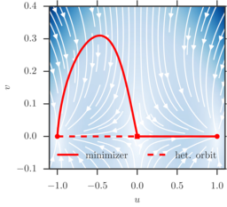

# RateSystem 

```@example RateSystem
using CriticalTransitions

using CairoMakie
using CairoMakie.Makie.MathTeXEngine: get_font
font = (;
    regular=get_font(:regular), bold=get_font(:bold),
    italic=get_font(:italic), bold_italic=get_font(:bolditalic)
);
```

Let us explore the features of [CriticalTransitions.jl](https://github.com/JuliaDynamics/CriticalTransitions.jl) with Maier-Stein model.

## Prototypical model for R-tipping, with critical rate r = 4/3

The following simple one-dimensional model with one attractor is given by the following ordinary differential equations:
```math
\begin{aligned}
    \dot{x} &= (x+\lambda)^2 - 1
\end{aligned}
```
The parameter ``\lambda`` shifts the location of the extrema of the drift field.

```@example RateSystem
function f(u,p,t) # out-of-place
    x = u[1]
    λ = p[1]
    dx = (x+λ)^2 - 1
    return SVector{1}(dx)
end
lambda = 0.0 
p = [lambda]
z₀ = [-1.]
auto_sys = CoupledODEs(f,z₀,p)
```

## Non-autonomous case

Now, we define the time-dependent parameter function ``\lambda(t)`` to make the system non-autonomous and investigate the system's behaviour under parameter rampings.

```@example RateSystem
function λ(p,t)
    λ_max = p[1]
    lambda = (λ_max/2)*(tanh(λ_max*t/2)+1)
    return SVector{1}(lambda)
end
```
We define the following parameters
```
r = 4/3-0.02
λ_max = 3.
p_lambda = [λ_max]
t_start = -Inf
t_end = Inf
t0 = -10.
```

## Attractors

We start by investigating the deterministic dynamics of the Maier-Stein model.

The function `fixed points` return the attractors, their eigenvalues and stability within the state space volume defined by `bmin` and `bmax`.

```@example GMAM
using ChaosTools

u_min = -1.1;
u_max = 1.1;
v_min = -0.4;
v_max = 0.4;
bmin = [u_min, v_min];
bmax = [u_max, v_max];
fp, eig, stab = fixedpoints(sys, bmin, bmax)
stable_fp = fp[stab]
```

```@example GMAM
using LinearAlgebra: norm
res = 100
u_range = range(u_min, u_max, length=res)
v_range = range(v_min, v_max, length=res)

du(u, v) = u - u^3 - 10 * u * v^2
dv(u, v) = -(1 + u^2) * v
odeSol(u, v) = Point2f(du(u, v), dv(u, v))

z = [norm([du(x, y), dv(x, y)]) for x in u_range, y in v_range]
zmin, zmax = minimum(z), maximum(z)

fig = Figure(size=(600, 400), fontsize=13)
ax = Axis(fig[1, 1], xlabel="u", ylabel="v", aspect=1.4,
    xgridcolor=:transparent, ygridcolor=:transparent,
    ylabelrotation=0)

hm = heatmap!(ax, u_range, v_range, z, colormap=:Blues, colorrange=(zmin, zmax))
Colorbar(fig[1, 2], hm; label="", width=15, ticksize=15, tickalign=1)
streamplot!(ax, odeSol, (u_min, u_max), (v_min, v_max);
    gridsize=(20, 20), arrow_size=10, stepsize=0.01,
    colormap=[:black, :black]
)
colgap!(fig.layout, 7)
limits!(u_min, u_max, v_min, v_max)
fig

[scatter!(ax, Point(fp[i]), color=stab[i] > 0 ? :red : :dodgerblue,
    markersize=10) for i in eachindex(fp)]
fig
```

We can simulate a stochastic trajectory using the function `trajectory`.

```@example GMAM
tr, ts  = trajectory(sys, 1000)

fig = Figure(size=(1000, 400), fontsize=13)
ax1 = Axis(fig[1, 1], xlabel="t", ylabel="u", aspect=1.2,
    xgridcolor=:transparent, ygridcolor=:transparent,
    ylabelrotation=0)
ax2 = Axis(fig[1, 2], xlabel="u", ylabel="v", aspect=1.2,
    xgridcolor=:transparent, ygridcolor=:transparent,
    ylabelrotation=0)

lines!(ax1, ts, first.(tr); linewidth=2, color=:black)

hm = heatmap!(ax2, u_range, v_range, z, colormap=:Blues, colorrange=(zmin, zmax))
Colorbar(fig[1, 3], hm; label="", width=15, ticksize=15, tickalign=1)
streamplot!(ax2, odeSol, (u_min, u_max), (v_min, v_max);
    gridsize=(20, 20), arrow_size=10, stepsize=0.01,
    colormap=[:white, :white]
)
colgap!(fig.layout, 7)
limits!(u_min, u_max, v_min, v_max)
fig

[scatter!(ax2, Point(fp[i]), color=stab[i] > 0 ? :red : :dodgerblue,
    markersize=10) for i in eachindex(fp)]

lines!(ax2, reduce(hcat, tr), linewidth=1, color=(:black, 0.2))
fig
```

## Transitions

We can quickly find a path which computes a transition from one attractor to another using the function `transition.

```@example GMAM
paths_ends = (fp[stab][1], fp[stab][2])
path, time, success = transition(sys, paths_ends...);
```

```@example GMAM
fig = Figure(size=(600, 400), fontsize=13)
ax = Axis(fig[1, 1], xlabel="u", ylabel="v", aspect=1.4,
    xgridcolor=:transparent, ygridcolor=:transparent,
    ylabelrotation=0)

hm = heatmap!(ax, u_range, v_range, z, colormap=:Blues, colorrange=(zmin, zmax))
Colorbar(fig[1, 2], hm; label="", width=15, ticksize=15, tickalign=1)
streamplot!(ax, odeSol, (u_min, u_max), (v_min, v_max);
    gridsize=(20, 20), arrow_size=10, stepsize=0.01,
    colormap=[:white, :white]
)
colgap!(fig.layout, 7)
limits!(u_min, u_max, v_min, v_max)
fig

[scatter!(ax, Point(fp[i]), color=stab[i] > 0 ? :red : :dodgerblue,
    markersize=10) for i in eachindex(fp)]
fig

lines!(ax, path, color=:black)
fig
```

If we want to compute many: `transitions` is the function to use.

```@example GMAM
tt = transitions(sys, paths_ends..., 3; tmax=1e3);
```

```@example GMAM
fig = Figure(size=(600, 400), fontsize=13)
ax = Axis(fig[1, 1], xlabel="u", ylabel="v", aspect=1.4,
    xgridcolor=:transparent, ygridcolor=:transparent,
    ylabelrotation=0)

hm = heatmap!(ax, u_range, v_range, z, colormap=:Blues, colorrange=(zmin, zmax))
Colorbar(fig[1, 2], hm; label="", width=15, ticksize=15, tickalign=1)
streamplot!(ax, odeSol, (u_min, u_max), (v_min, v_max);
    gridsize=(20, 20), arrow_size=10, stepsize=0.01,
    colormap=[:black, :black]
)
colgap!(fig.layout, 7)
limits!(u_min, u_max, v_min, v_max)
fig

[scatter!(ax, Point(fp[i]), color=stab[i] > 0 ? :red : :dodgerblue,
    markersize=10) for i in eachindex(fp)]

for i in 1:length(tt.paths)
    lines!(ax, tt.paths[i])
end
fig
```

## Large deviation theory

In the context of nonlinear dynamics, Large Deviation Theory provides tools to quantify the probability of rare events that deviate significantly from the system's typical behavior. These rare events might be extreme values of a system's output, sudden transitions between different states, or other phenomena that occur with very low probability but can have significant implications for the system's overall behavior.

Large deviation theory applies principles from probability theory and statistical mechanics to develop a rigorous mathematical description of these rare events. It uses the concept of a rate function, which measures the exponential decay rate of the probability of large deviations from the mean or typical behavior. This rate function plays a crucial role in quantifying the likelihood of rare events and understanding their impact on the system.

For example, in a system exhibiting chaotic behavior, LDT can help quantify the probability of sudden large shifts in the system's trajectory. Similarly, in a system with multiple stable states, it can provide insight into the likelihood and pathways of transitions between these states under fluctuations. In the context of the Minimum Action Method (MAM) and the Geometric Minimum Action Method (gMAM), Large Deviation Theory is used to handle the large deviations action functional on the space of curves. This is a key part of how these methods analyze dynamical systems.

The Maier-Stein model is a typical benchmark to test such LDT techniques. Let us try to reproduce the following figure from [Tobias Grafke's blog post](https://homepages.warwick.ac.uk/staff/T.Grafke/simplified-geometric-minimum-action-method-for-the-computation-of-instantons.html):



Let us first make an initial path:

```@example GMAM
xx = range(-1.0, 1.0, length=100)
yy = 0.3 .* (-xx .^ 2 .+ 1)
init = Matrix([xx yy]')
```

`geometric_min_action_method` computes the minimizer of the Freidlin-Wentzell action using the geometric minimum action method (gMAM), to find the minimum action path (instanton) between an initial state x_i and final state x_f. The Minimum Action Method (MAM) is a more traditional approach, while the Geometric Minimum Action Method (gMAM) is a blend of the original MAM and the [string method](https://doi.org/10.1103/PhysRevB.66.052301).

```@example GMAM
gm = geometric_min_action_method(sys, init, maxiter=500; show_progress=false)
MLP = gm.path
```

```@example GMAM
fig = Figure(size=(600, 400), fontsize=13)
ax = Axis(fig[1, 1], xlabel="u", ylabel="v", aspect=1.4,
    xgridcolor=:transparent, ygridcolor=:transparent,
    ylabelrotation=0)

hm = heatmap!(ax, u_range, v_range, z, colormap=:Blues, colorrange=(zmin, zmax))
Colorbar(fig[1, 2], hm; label="", width=15, ticksize=15, tickalign=1)
streamplot!(ax, odeSol, (u_min, u_max), (v_min, v_max);
    gridsize=(20, 20), arrow_size=10, stepsize=0.01,
    colormap=[:black, :black]
)
colgap!(fig.layout, 7)
limits!(u_min, u_max, v_min, v_max)
fig

[scatter!(ax, Point(fp[i]), color=stab[i] > 0 ? :red : :dodgerblue,
    markersize=10) for i in eachindex(fp)]

lines!(ax, init, linewidth=3, color=:black, linestyle=:dash)
lines!(ax, MLP, linewidth=3, color=:orange)
fig
```

---
Author: Orjan Ameye (orjan.ameye@hotmail.com)
Date: 13 Feb 2024
