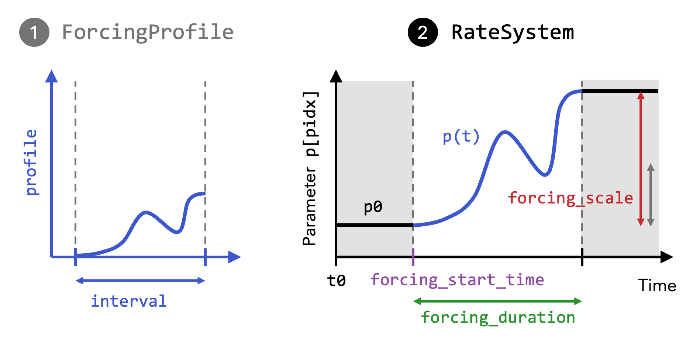

# Example: Defining a `RateSystem`

Consider a dynamical system `ds` with autonomous drift (a `CoupledODEs` or `CoupledSDEs` with autonomous drift) of which
you want to ramp one or more parameters, i.e. change the parameter values over time.

Using the `RateSystem` type, you can achieve this in two steps:
1) Specify a `dict` containing - for each parameter you would like to ramp - a `ForcingProfile` that describes the rampings' shape `p(t)` over an `interval`.
2) Apply these parametric forcings to the system `ds` by constructing a `RateSystem`.



The profiles' `intervals` are rescaled to system time units using the configured `start` and `duration` values.
Then, for each ramped parameter, for
- `t < forcing_start_time`
    - the system has an autonomous drift, with parameter given by the underlying system `ds`
- `forcing_start_time < t < forcing_start_time + forcing_duration`
    - the system has a non-autonomous drift with the parameter given by the respective `ForcingProfile`, multiplied by `forcing_scale`
- `t > forcing_start_time + forcing_duration`
    - the system has again an autonomous drift, with parameter fixed at the value attained at the end of the forcing interval (i.e. at `t = forcing_start_time + forcing_duration`).

This setting is widely used and convenient for studying rate-dependent tipping.

# Example 1: single-parameter `RateSystem`

````@example RateSystem
using CriticalTransitions
using CairoMakie
using StaticArrays


function f(u, p, t)
    x = u[1]
    dx = (x + p[1])^2 - 1
    return SVector{1}(dx)
end

x0 = [-1.0]
ds = CoupledODEs(f, x0, [0.0]) # one-parameter autonomous system
````

Forcing profile (section of a function over an interval)

````@example RateSystem
profile(t) = tanh(t)
interval = (-5.0, 5.0)
fp = ForcingProfile(profile, interval)
````

Note that the `interval` is given in arbitrary units - the profile is
rescaled to your system's units in the next step, where we apply the
forcing to the first parameter

````@example RateSystem
pidx = 1
forcing_start_time = 20.0
forcing_duration = 105.0
forcing_scale = 3.0
t0 = 0.0

rs = RateSystem(ds, Dict(pidx => fp); forcing_start_time, forcing_duration, forcing_scale, t0)
````

Note that the `forcing_scale` is a multiplication factor that scales
the profile `fp.profile`. Here, we have $p(5)-p(-5) \approx 2$,
so the amplitude of the parameter change is $6$ after multiplying
with `forcing_scale = 3`.

You can get the parameter value at a given time

````@example RateSystem
println("p(t=0) = ", parameter(rs, 0.0, pidx))
````

!!! note
    You can modify the forcing later to achieve different rates with `set_forcing_duration!` and `set_forcing_scale!`.

The `RateSystem` type behaves just like the type of underlying autonomous
system, in this case a `CoupledODEs`. Thus, we can simply call the
`trajectory` function to simulate either the autonomous system `ds`
or the nonautonomous system `rs`.

````@example RateSystem
T = forcing_duration + 40.0  # total simulation time
traj_ds = trajectory(ds, T, x0)
traj_rs = trajectory(rs, T, x0)
````

Let's compare the two trajectories:

````@example RateSystem
fig = Figure();
axs = Axis(fig[1, 1]; xlabel="Time", ylabel="x");
lines!(
    axs,
    t0 .+ traj_ds[2],
    traj_ds[1][:, 1];
    linewidth=2,
    label="Autonomous CoupledODEs (ds)",
);
lines!(
    axs,
    traj_rs[2],
    traj_rs[1][:, 1];
    linewidth=2,
    label="Nonautonomous RateSystem (rs)",
);
axislegend(axs; position=:lb);
fig
````

While the autonomous system `ds` remains at the fixed point $x^*=-1$,
the nonautonomous system tracks the moving equilibrium until reaching
the stable fixed point $x^*=-7$ of the future limit system (i.e.
the autonomous limit system after the parameter change) where `p=6`.


# Example 2: multiple-parameter `RateSystem` (Dict-based forcing)

Define a slightly different system with two parameters to demonstrate forcing two keys
Parameter 1 enters nonlinearly, parameter 2 shifts the drift additively

````@example RateSystem
function f2(u, p, t)
    x = u[1]
    dx = (x + p[1])^2 - 1 + 0.2 * p[2]
    return SVector{1}(dx)
end

x0 = [-1.0]
p0 = [0.0, 0.0]
ds2 = CoupledODEs(f2, x0, p0)
````

Two forcing profiles

````@example RateSystem
fp1 = ForcingProfile(tanh, (-5.0, 5.0))
fp2 = ForcingProfile(sin, (-pi, pi))

forcing = Dict(1 => fp1, 2 => fp2) # keys are parameter indices (or keys accepted by `set_parameter!`)
````

Per-key control for start/duration/scale

````@example RateSystem
rs2 = RateSystem(ds2, forcing;
    forcing_start_time = Dict(1 => 20.0, 2 => 25.0),
    forcing_duration   = Dict(1 => 105.0, 2 => 50.0),
    forcing_scale      = Dict(1 => 3.0, 2 => 2.0),
    t0 = 0.0,
)
````

Sample parameters over time and plot both forced parameters

````@example RateSystem
tvec = range(0.0, 100.0; length = 200)
ps = parameters.(Ref(rs2), tvec)
p1 = getindex.(ps, 1)
p2 = getindex.(ps, 2)

fig = Figure()
ax = Axis(fig[1, 1]; xlabel = "time", ylabel = "parameter value")
lines!(ax, tvec, p1; label = "p1")
lines!(ax, tvec, p2; label = "p2")
axislegend(ax)
fig
````

Note that the `RateSystem` constructor accepts either scalar `forcing_start_time`, `forcing_duration`, `forcing_scale` values (applied to all keys) or dictionaries mapping each key to its own value.

