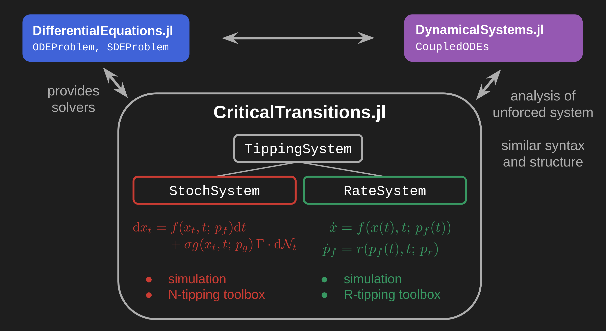

# CriticalTransitions.jl

*A Julia package for the numerical investigation of noise- and rate-induced transitions in dynamical systems.*

Building on [DynamicalSystems.jl](https://juliadynamics.github.io/DynamicalSystems.jl/stable/) and [DifferentialEquations.jl](https://diffeq.sciml.ai/stable/), this package aims to provide a toolbox for dynamical systems under time-dependent forcing, with a focus on tipping phenomena and metastability.

!!! compat "Compatibility"
    This version (`v0.2`) is now compatible with `DynamicalSystems v3`.

!!! info "Current features"
    * **Stability analysis**: Fixed points, linear stability, basins of attraction, edge tracking
    * **Stochastic simulation**: Gaussian noise, uncorrelated and correlated, additive and multiplicative
    * **Transition path sampling**: Ensemble sampling by direct simulation and Pathspace Langevin MCMC
    * **Large deviation theory**: Action functionals and minimization algorithms (MAM, gMAM)

!!! ukw "Planned features"
    * **Rare event simulation**: importance sampling, AMS
    * **Quasipotentials**: Ordered line integral method (OLIM)
    * **Rate-induced tipping** tools
    * ...?

Developers: Reyk Börner, Ryan Deeley and Raphael Römer

Thanks to Jeroen Wouters, Calvin Nesbitt, Tobias Grafke, George Datseris and Oliver Mehling

This work is part of the [CriticalEarth](https://criticalearth.eu) project.